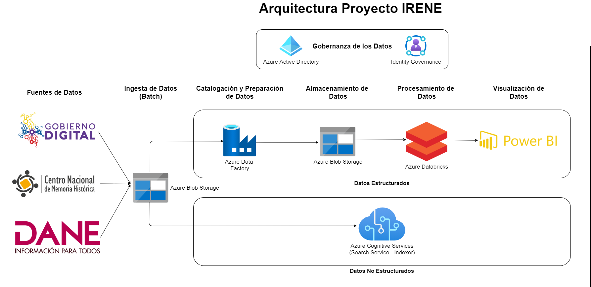

# Azure Analytics Project about the Colombian Armed Conflict
Analytics project about the colombian armed conflict. Analysis of victims, regions and evolution of the problem. Architecture deployed in Microsoft Azure gathering structured and unstructured data from the national government and applying data pipelines to capture, catalog, clean, prepare and process data in an agile way.

## Architecture

## Methodology

